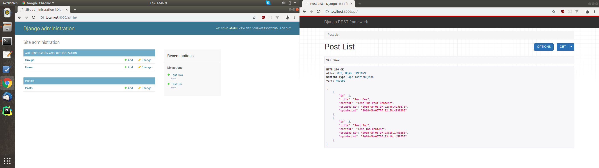

# Docker Stack With Postgresql, Postgis and TimeScaleDB
A Django REST API Docker Stack with TimescaleDB and Postgresql/Postgis Backend

What the repository has
#REST API
```
- Django Framwork => 2.1
- DjangoRestFramwork => 3.8.2
```
#The Database 
PostgreSQL + PostGIS + TimescaleDB ready-to-use docker image 
```
- image: binakot/postgresql-postgis-timescaledb
```
Docker image with:
```
- PostgreSQL: 10.4 
- PostGIS: 2.4.4 
- TimescaleDB: 0.10.1 
```
# Getting Started
These instructions will get you a copy of the project up and running on your local machine for development and testing purposes.

### For Use in a Docker Swarm

This example only works on a Docker Swarm of version 1.12 or
greater. Please see link:https://docs.docker.com/engine/swarm/swarm-tutorial/create-swarm 
for details on setting up a test Docker Swarm cluster.
```
docker stack deploy --compose-file=./docker-swarm.yml pg-stack
```

 
### Installing

A step by step series of examples that tell you how to get a development env running

#Setup

1. Clone the repository
```
- git clone https://github.com/songokjesse/docker_stack_with_timescale_and_postgresql.git
- cd docker_stack_with_timescale_and_postgresql
```

2. download the images by running the following command
```
- sudo docker-compose build
```

Run the migrations
    
```
- sudo docker-compose run web python src/MyDjangoProject/manage.py migrate
    
```
Create SuperUser
    
```
sudo docker-compose run web python src/MyDjangoProject/manage.py createsuperuser```
    
```
3. Start the application
```
- sudo docker-compose up
```
4. Access the admin dashboard using 
```
http://127.0.0.0:8000/admin
```
5. Access the REST API using 
```
http://127.0.0.0:8000/api
```
# ScreenShot
